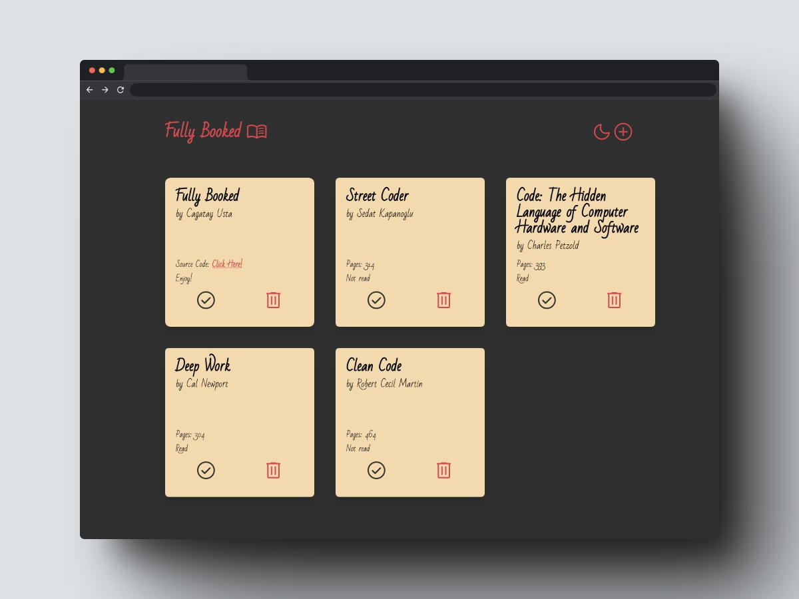

# Description

Fully Booked is a web application that allows users to keep track of books they have read, want to read, or are currently reading. Users can easily add and remove in their virtual bookshelf. The app is responsively designed for both desktop and mobile devices and also includes a dark mode feature for a visually appealing experience. It was built as a homework project from The Odin Project, using HTML, CSS, JavaScript, Vite, and Tailwind CSS as technologies.

  

Check out the live [preview here](https://cagatay-usta.github.io/library/)

  

 

# Features

- Add/Remove Books
- Dark Mode
- Responsive Design
- (Soon to be added) Store book history locally

 

 

# Installation

You can use it directly online, hosted on Github Pages [here.](https://cagatay-usta.github.io/library/)
 
If you rather want to check the source code and modify it:

1. Clone the repository to your local machine using git clone.
2. Navigate to the project directory in your terminal.
3. Install the dependencies using npm install or yarn install.
4. Start the development server using npm run dev or yarn dev.
5. Open your web browser and go to http://localhost:3000 to access the app.
6. If you want to make a new build, refer to Tailwind CSS docs for config settings to minify the css file.

 

# Tech Stack

- 

- 

- 

- 

- 

# Contributing

Contributions to the Fully Booked app are welcome, although not needed as I developed this as a learning project :) If you find any issues or have suggestions for improvements, please feel free to open an issue or submit a pull request. All feedback is appreciated.

# License

The Fully Booked app is open-source software released under the [MIT License.](/LICENSE)

# Contact

If you have any feedback, comments, or inquiries, please feel free to contact me. I would be happy to connect with you!

- Email: cagatay_usta@windowslive.com
- GitHub: [cagatay-usta](https://github.com/cagatay-usta)
- LinkedIn: [Cagatay Usta](https://www.linkedin.com/in/cagatay-usta/)

Thank you for checking out my repo!
